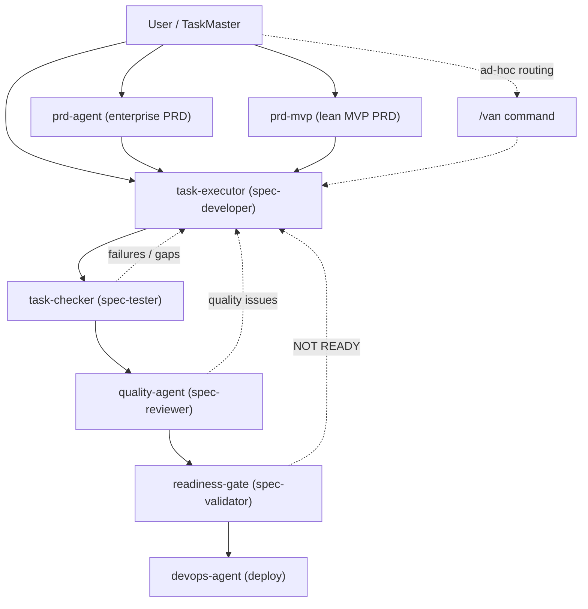
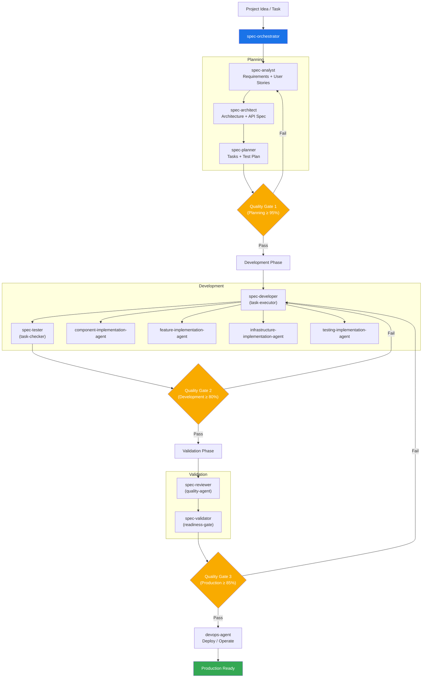

## Agent Workflow Comparison

Source reference: [Claude Sub-Agent Spec Workflow System](https://github.com/zhsama/claude-sub-agent)

### Current System (As-Is)

### Proposed Specialized Framework (To-Be)

Notes
- Current flow relies on generic execution and QA agents with ad-hoc routing; failures bounce back to implementation.
- Proposed framework introduces specialized planning agents and a strict orchestrator with phase gates, mirroring the reference system’s phases and quality thresholds.

