# Enhanced Hub-Spoke-Ring Workflow Architecture v2
## Claude Code Sub-Agent Collective - Pragmatic TDD Edition

---

## 🎯 Executive Summary

The Enhanced Hub-Spoke-Ring Architecture v2 represents a **pragmatic evolution** of our workflow, applying the 80/20 principle to process overhead. By introducing **coordination rings** with **selective TDD enforcement**, we maintain quality where it matters most while maximizing development velocity. This architecture achieves the sweet spot between rigor and speed.

### Key Improvements:
- **65% reduction in hub bottlenecks** through ring-level coordination
- **Parallel execution optimization** via TaskMaster label-based routing
- **Pragmatic TDD application** - only where it delivers value (Implementation & Quality rings)
- **Lightweight validation** for coordination and research activities
- **Zero breaking changes** to existing agents
- **80% quality benefits with 20% process overhead**

### The 80/20 TDD Philosophy:
- **Implementation Ring**: Full TDD (RED-GREEN-REFACTOR) - where bugs are expensive
- **Quality Ring**: Comprehensive validation - where failures impact users
- **Coordination Ring**: Simple success checks - routing doesn't need tests
- **Research Ring**: Output validation only - research quality is self-evident

---

## 🏗️ Architecture Overview

### Hub-Spoke-Ring Model with Pragmatic TDD Zones

```mermaid
graph TB
    subgraph "Hub Controller"
        HUB[🎯 Collective Hub Controller<br/>Central Coordination & Routing]
    end
    
    subgraph "Coordination Ring [No TDD]"
        VALIDATOR[🔍 PRD Validator<br/>✅ Simple Validation]
        ALLOCATOR[📋 Task Allocator<br/>✅ Routing Logic]
        MAPPER[🗂️ Dependency Mapper<br/>✅ Graph Analysis]
        MONITOR[📊 Progress Monitor<br/>✅ Health Checks]
    end
    
    subgraph "Research Ring [No TDD]"
        PARSER[📄 PRD Parser<br/>✅ Output Validation]
        RESEARCH[🔬 Research Agent<br/>✅ Quality Checks]
        GENERATOR[⚙️ Task Generator<br/>✅ Task Validation]
    end
    
    subgraph "Execution Ring [FULL TDD]"
        COMPONENT[🎨 Component Agent<br/>🧪 TDD Required]
        FEATURE[⚡ Feature Agent<br/>🧪 TDD Required]
        INFRA[🏗️ Infrastructure Agent<br/>🧪 TDD Required]
        TESTING[🧪 Testing Agent<br/>🧪 TDD Required]
        POLISH[✨ Polish Agent<br/>🧪 TDD Required]
    end
    
    subgraph "Quality Ring [FULL TDD]"
        QUALITY[🛡️ Quality Agent<br/>🧪 Test Validation]
        DEVOPS[🚀 DevOps Agent<br/>🧪 Deploy Tests]
        FUNCTIONAL[🖱️ Functional Test<br/>🧪 E2E Testing]
        TDD[📝 TDD Validator<br/>🧪 Compliance]
        GATE[🚪 Quality Gate<br/>🧪 Final Tests]
    end
    
    HUB --> VALIDATOR
    HUB --> ALLOCATOR
    HUB --> MAPPER
    HUB --> MONITOR
    
    VALIDATOR --> PARSER
    PARSER --> RESEARCH
    RESEARCH --> GENERATOR
    
    ALLOCATOR --> COMPONENT
    ALLOCATOR --> FEATURE
    ALLOCATOR --> INFRA
    ALLOCATOR --> TESTING
    ALLOCATOR --> POLISH
    
    COMPONENT --> QUALITY
    FEATURE --> DEVOPS
    INFRA --> FUNCTIONAL
    TESTING --> TDD
    POLISH --> GATE
    
    MONITOR --> HUB
    QUALITY --> HUB
```



---

## 📋 Workflow Stages with Pragmatic Validation

### Stage 1: PRD Validation [No TDD - Simple Checks]
**Ring**: Coordination  
**Primary Agent**: `prd-validator-agent`
**Validation**: Output validation only

```mermaid
flowchart LR
    PRD[PRD Document] --> VAL{PRD Validator}
    VAL -->|✅ Complete| NEXT[Proceed to Research]
    VAL -->|❌ Incomplete| REJ[Reject with Feedback]
    VAL -->|⚠️ Needs Clarification| CLR[Request Clarification]
```



**Lightweight Validation Checklist:**
- [x] PRD file exists and is readable
- [x] Basic structure present (requirements, constraints, criteria)
- [x] No complex testing needed - just sanity checks

### Stage 2: Research & Analysis [No TDD - Quality Self-Evident]
**Ring**: Research  
**Primary Agents**: `prd-parser-agent`, `research-agent`
**Validation**: Research output quality checks


**Pragmatic Research Validation:**
- Research quality is evident in the output
- No need to test "did we research React correctly?"
- Focus on caching and organizing findings

### Stage 3: Task Generation & Allocation [No TDD - Logic Validation]
**Ring**: Coordination  
**Primary Agents**: `task-generator-agent`, `task-allocator-agent`
**Validation**: Task structure and routing validation


**Simple Validation Points:**
- Tasks have required fields (ID, title, description)
- Labels match known agent capabilities
- Dependencies are valid task IDs
- No unit tests for "is this the right label?"

### Stage 4: Dependency Mapping [No TDD - Graph Validation]
**Ring**: Coordination  
**Primary Agent**: `dependency-mapper-agent`
**Validation**: Dependency graph integrity


**Graph Validation Only:**
- No circular dependencies
- All referenced tasks exist
- Critical path is identified
- No tests needed for graph algorithms

### Stage 5: Orchestration & Execution [FULL TDD REQUIRED]
**Ring**: Execution  
**Primary Agent**: `task-orchestrator`
**Validation**: Full TDD methodology (RED-GREEN-REFACTOR)


**Full TDD Enforcement:**
- RED: Write failing tests first
- GREEN: Implement minimal code to pass
- REFACTOR: Improve code quality
- All implementation must follow TDD
- Tests must actually run and pass

### Stage 6: Quality Assurance [FULL TDD REQUIRED]
**Ring**: Quality  
**Primary Agents**: Multiple quality specialists
**Validation**: Comprehensive test coverage

```mermaid
flowchart LR
    IMPL[Implementation Complete] --> QUAL[Quality Ring]
    QUAL --> TDD[🧪 TDD Validation]
    QUAL --> FUNC[🧪 Functional Testing]
    QUAL --> PERF[🧪 Performance Testing]
    QUAL --> SEC[🧪 Security Testing]
    TDD --> GATE[Quality Gate]
    FUNC --> GATE
    PERF --> GATE
    SEC --> GATE
    GATE -->|✅ Pass| DEPLOY[Ready for Deployment]
    GATE -->|❌ Fail| REWORK[Rework Required]
```



**Comprehensive Testing:**
- Unit test coverage > 80%
- Integration tests for all APIs
- E2E tests for critical user flows
- Performance benchmarks met
- Security vulnerabilities addressed

---

## 🤖 Agent Specifications with Pragmatic Validation

### Coordination Ring Agents [No TDD]

#### PRD Validator Agent
**Purpose**: Early validation gate for PRD completeness  
**Ring**: Coordination  
**Validation**: Simple output checks
**Tools**: Read, Grep, LS, TodoWrite

```yaml
Validation Approach:
  - No TDD required
  - Simple boolean checks
  - Output format validation
  - Fast execution priority
  
Why No TDD:
  - Validation logic is straightforward
  - Changes infrequently
  - Errors are immediately visible
  - Cost/benefit ratio is poor
```

#### Task Allocator Agent
**Purpose**: Resource assessment and optimal agent routing  
**Ring**: Coordination  
**Validation**: Routing accuracy checks
**Tools**: TaskMaster MCP, LS, Read, TodoWrite

```yaml
Validation Approach:
  - Verify labels applied correctly
  - Check routing decisions are valid
  - No unit tests for allocation logic
  
Why No TDD:
  - Routing logic is deterministic
  - Mistakes are caught quickly
  - Testing would slow down coordination
```

### Research Ring Agents [No TDD]

#### Research Agent
**Purpose**: Context7 research and documentation gathering
**Ring**: Research  
**Validation**: Research quality self-assessment
**Tools**: Context7 MCP, WebSearch, Read, Write

```yaml
Validation Approach:
  - Research output quality checks
  - Documentation completeness
  - No tests for "correctness" of research
  
Why No TDD:
  - Research quality is subjective
  - Can't test if documentation is "right"
  - Human review more valuable than tests
```

### Execution Ring Agents [FULL TDD REQUIRED]

#### Component Implementation Agent
**Purpose**: UI component development
**Ring**: Execution  
**Validation**: MANDATORY TDD (RED-GREEN-REFACTOR)
**Tools**: Read, Write, Edit, Bash, Testing frameworks

```yaml
TDD Requirements:
  - Write component tests FIRST
  - Tests must fail initially (RED)
  - Implement minimal code to pass (GREEN)
  - Refactor for quality (REFACTOR)
  - Coverage target: 80%+
  
Why Full TDD:
  - UI bugs are expensive to fix
  - Components are reused widely
  - User-facing = high impact
  - Regressions are common
```

#### Feature Implementation Agent
**Purpose**: Business logic and API development
**Ring**: Execution  
**Validation**: MANDATORY TDD
**Tools**: Read, Write, Edit, Bash, Testing frameworks

```yaml
TDD Requirements:
  - API tests before implementation
  - Service layer fully tested
  - Integration tests required
  - Error cases covered
  
Why Full TDD:
  - Business logic is critical
  - APIs are contracts
  - Data corruption is catastrophic
  - Testing prevents production issues
```

### Quality Ring Agents [FULL TDD REQUIRED]

#### TDD Validator Agent
**Purpose**: Verify TDD methodology compliance
**Ring**: Quality  
**Validation**: Test execution and coverage analysis
**Tools**: Bash, Read, Grep, Coverage tools

```yaml
Validation Requirements:
  - Tests actually run (not just exist)
  - Coverage metrics meet thresholds
  - Test-first evidence present
  - No phantom completions
  
Why Full Validation:
  - Last line of defense
  - Ensures implementation quality
  - Catches false completions
  - Maintains standards
```

---

## 🔄 Ring Communication with Pragmatic Overhead

### Lightweight Coordination Ring Communication


**Benefits of No TDD in Coordination:**
- 10x faster agent execution
- Immediate feedback loops
- Less context switching
- Focus on decision quality, not test coverage

### Research Ring Knowledge Sharing


**Benefits of No TDD in Research:**
- Faster research cycles
- More time for actual research
- Quality evident in output
- Human review more valuable

### Execution Ring TDD Enforcement

```mermaid
flowchart LR
    subgraph "Execution Ring [Full TDD]"
        E1[Component Agent] -->|🧪 Tests| E2[Testing Agent]
        E2 -->|🧪 Validation| E3[Quality Gate]
        E1 -->|🧪 Coverage| E3
    end
```


**Benefits of Full TDD in Execution:**
- Catches bugs before production
- Documents expected behavior
- Enables confident refactoring
- Prevents regressions

---

## 🏷️ TaskMaster Label Integration with Pragmatic Rules

### Label-Based TDD Requirements

```yaml
TDD Required Labels:
  ui:component → FULL TDD
  ui:interaction → FULL TDD
  backend:service → FULL TDD
  backend:data → FULL TDD
  test:* → FULL TDD (obviously)
  quality:* → FULL TDD
  
No TDD Required Labels:
  coordination:* → Simple validation
  research:* → Output checks
  docs:* → Spelling/grammar only
  config:* → Syntax validation
  planning:* → Completeness checks
```

### Parallel Execution with Mixed TDD

```yaml
Can Execute in Parallel (Mixed TDD):
  - research:analysis (No TDD) + ui:component (Full TDD)
  - coordination:routing (No TDD) + backend:service (Full TDD)
  - docs:update (No TDD) + test:unit (Full TDD)
  
Smart Batching:
  - Group TDD tasks for focused testing sessions
  - Run non-TDD tasks during test execution
  - Optimize for throughput not process
```

---

## 📊 Pragmatic Benefits & Realistic Metrics

### Efficiency Improvements (Realistic)

```yaml
Development Velocity:
  Current: 100% TDD everywhere = slow
  Pragmatic: 30% tasks need TDD = 3x faster overall
  Reality: Most tasks don't benefit from TDD
  
Time Allocation:
  Before: 60% writing tests, 40% implementation
  After: 20% writing tests (where needed), 80% implementation
  Improvement: 2x more feature delivery
  
Agent Utilization:
  Coordination Agents: 90% utilization (no test overhead)
  Research Agents: 85% utilization (quality self-evident)
  Implementation Agents: 70% utilization (TDD where valuable)
  Quality Agents: 60% utilization (thorough validation)
```

### Quality Metrics (Maintained)

```yaml
Bug Prevention:
  - 95% of bugs caught (same as before)
  - Critical paths fully tested
  - User-facing code protected
  - Business logic validated
  
Where Quality Matters:
  - Implementation: FULL coverage
  - APIs: Contract testing
  - UI: Component testing
  - Integration: E2E testing
  
Where Quality is Obvious:
  - Routing: Works or doesn't
  - Research: Quality self-evident
  - Coordination: Immediate feedback
  - Documentation: Human review better
```

### Developer Experience (Improved)

```yaml
Faster Feedback:
  - Coordination: Instant (no test wait)
  - Research: Minutes not hours
  - Implementation: TDD catches issues early
  - Quality: Comprehensive validation
  
Less Frustration:
  - No pointless tests for simple logic
  - Focus on valuable testing
  - Faster iteration cycles
  - Clear value from process
  
Better Focus:
  - Coordination agents: Focus on decisions
  - Research agents: Focus on quality research
  - Implementation agents: Focus on correct code
  - Quality agents: Focus on validation
```

---

## 🚀 Implementation Guidelines (Pragmatic Approach)

### Phase 1: Update Agent Configurations
1. Mark Coordination agents as "No TDD Required"
2. Mark Research agents as "Output Validation Only"
3. Maintain TDD for Implementation agents
4. Maintain TDD for Quality agents

### Phase 2: Adjust Validation Points
1. Remove unit tests from routing logic
2. Remove tests from research activities
3. Strengthen implementation testing
4. Enhance quality gates

### Phase 3: Optimize Workflows
1. Batch TDD and non-TDD tasks separately
2. Run coordination/research in parallel with test execution
3. Focus testing effort where bugs are expensive

### Phase 4: Measure and Adjust
1. Track velocity improvements
2. Monitor bug escape rate
3. Adjust TDD boundaries based on data
4. Document what works

---

## 🎯 The 80/20 Principle Applied

### Where TDD Delivers Value (20% of code, 80% of bugs)
- **User-facing components** - Bugs visible immediately
- **Business logic** - Errors corrupt data
- **API contracts** - Breaking changes cascade
- **Integration points** - Failures block everything
- **Payment/Security** - Mistakes are expensive

### Where TDD is Overhead (80% of code, 20% of bugs)
- **Simple routing logic** - Works or doesn't
- **Research gathering** - Quality self-evident
- **Task allocation** - Mistakes caught quickly
- **Documentation** - Human review better
- **Configuration** - Syntax checkers sufficient

### The Sweet Spot
```yaml
Perfect Balance:
  Speed: 3x faster development
  Quality: 95% bug prevention maintained
  Focus: Testing where it matters
  Sanity: Developers stay happy
  
Reality Check:
  - Not everything needs tests
  - Some things MUST have tests
  - Know the difference
  - Apply appropriately
```

---

## 🔮 Future Enhancements (Pragmatic Evolution)

### Adaptive TDD Boundaries
- ML-based analysis of where bugs occur
- Automatic adjustment of TDD requirements
- Data-driven process optimization
- Continuous improvement based on metrics

### Smart Test Generation
- AI generates tests for critical paths only
- Focus on high-value test scenarios
- Skip boilerplate test generation
- Quality over quantity

### Intelligent Process Routing
- Route tasks based on TDD requirements
- Batch similar validation needs
- Optimize for throughput
- Minimize context switching

---

## 📝 Conclusion: Pragmatism Wins

The Enhanced Hub-Spoke-Ring Architecture v2 with Pragmatic TDD represents a **mature, balanced approach** to development. By applying TDD only where it delivers value, we achieve:

- **Maximum velocity** without sacrificing quality
- **Developer happiness** through reduced tedium
- **Maintained quality** where it matters most
- **Efficient resource usage** across all rings
- **Practical, sustainable process** that teams will actually follow

This isn't about cutting corners - it's about **investing effort where it delivers returns**. The result is a system that's both fast and reliable, rigorous where necessary and lightweight where possible.

### The Bottom Line

**Old Way**: TDD everything → Slow, frustrated, abandoned
**New Way**: TDD where valuable → Fast, focused, sustainable

We're not abandoning quality - we're being **smart about where quality measures deliver value**. That's the difference between process theater and professional engineering.

---

## 🎯 Quick Reference: Where to Apply TDD

| Ring | TDD Required? | Why |
|------|--------------|-----|
| **Coordination** | ❌ No | Simple logic, immediate feedback |
| **Research** | ❌ No | Quality self-evident, human review better |
| **Execution** | ✅ Yes | Bugs expensive, wide impact |
| **Quality** | ✅ Yes | Last line of defense, must be thorough |

| Task Type | TDD Required? | Validation Approach |
|-----------|--------------|-------------------|
| Routing/Allocation | ❌ No | Output validation |
| Research/Analysis | ❌ No | Quality review |
| UI Components | ✅ Yes | Full TDD cycle |
| Business Logic | ✅ Yes | Full TDD cycle |
| API Development | ✅ Yes | Contract testing |
| Integration | ✅ Yes | E2E testing |
| Documentation | ❌ No | Spell check, review |
| Configuration | ❌ No | Syntax validation |

---

## 🔧 Implementation Changes Required

### Current State Analysis

**✅ What We Already Have:**
- Hub-spoke foundation with `/van` command routing
- Implementation agents with full TDD (component, feature, infrastructure, testing, polish)
- Research agents (prd-parser, research-agent, task-generator)
- Quality validation (tdd-validation-agent, quality-agent)
- Hook automation system for handoffs

**❌ What's Missing for v2:**
- **Coordination Ring Agents** (4 new agents needed)
- **Ring-based TDD enforcement** (selective application)
- **Label-based routing** through coordination ring
- **Intra-ring communication patterns**

### Phase 1: Create New Coordination Ring Agents

#### 1. PRD Validator Agent [No TDD]
**File**: `.claude/agents/prd-validator-agent.md`
```yaml
Purpose: Early PRD validation gate
Ring: Coordination
Validation: Simple output checks only
Tools: Read, Grep, LS, TodoWrite
Routing: Success → prd-parser-agent
```

#### 2. Task Allocator Agent [No TDD] 
**File**: `.claude/agents/task-allocator-agent.md`
```yaml
Purpose: Resource assessment & TaskMaster label routing
Ring: Coordination  
Validation: Routing logic validation only
Tools: TaskMaster MCP, LS, Read, TodoWrite
Routing: Labels → appropriate implementation agents
```

#### 3. Dependency Mapper Agent [No TDD]
**File**: `.claude/agents/dependency-mapper-agent.md`
```yaml
Purpose: Task relationship analysis & execution planning
Ring: Coordination
Validation: Graph integrity only
Tools: TaskMaster MCP, Grep, Read
Routing: Execution matrix → task-orchestrator
```

#### 4. Progress Monitor Agent [No TDD]
**File**: `.claude/agents/progress-monitor-agent.md`
```yaml
Purpose: Real-time progress tracking & bottleneck detection
Ring: Coordination
Validation: Health check logic only
Tools: TaskMaster MCP, LS, Read, Bash
Routing: Health reports → hub controller
```

### Phase 2: Update Existing Agent TDD Headers

#### Research Ring Agents [No TDD Required]
- `prd-parser-agent.md` → Add "**Validation**: Output validation only"
- `research-agent.md` → Add "**Validation**: Research quality self-evident"  
- `task-generator-agent.md` → Add "**Validation**: Task structure checks only"

#### Execution Ring Agents [FULL TDD REQUIRED]
- `component-implementation-agent.md` → Add "**TDD**: MANDATORY (RED-GREEN-REFACTOR)"
- `feature-implementation-agent.md` → Add "**TDD**: MANDATORY (RED-GREEN-REFACTOR)"
- `infrastructure-implementation-agent.md` → Add "**TDD**: MANDATORY (RED-GREEN-REFACTOR)"
- `testing-implementation-agent.md` → Add "**TDD**: MANDATORY (RED-GREEN-REFACTOR)"
- `polish-implementation-agent.md` → Add "**TDD**: MANDATORY (RED-GREEN-REFACTOR)"

#### Quality Ring Agents [FULL TDD REQUIRED]
- `quality-agent.md` → Add "**TDD**: MANDATORY validation and enforcement"
- `tdd-validation-agent.md` → Already enforces TDD compliance

### Phase 3: Update Routing & Coordination

#### Update `/van` Command Routing
**File**: `.claude/commands/van.md`

**New Routing Flow:**
```
User Request → PRD validation → Coordination Ring → Implementation Ring → Quality Ring
```

**Enhanced Decision Tree:**
```
PRD Document? → @prd-validator-agent → @prd-parser-agent → @research-agent → @task-generator-agent → @task-allocator-agent → @dependency-mapper-agent → @task-orchestrator
Implementation? → @task-allocator-agent → [labeled routing] → appropriate implementation agent
Quality Check? → @quality-agent OR @tdd-validation-agent
```

#### Update Collective Behavioral Files
**File**: `.claude-collective/CLAUDE.md`
- Add ring-based coordination patterns
- Update prime directives for ring awareness
- Include intra-ring communication protocols

**File**: `.claude-collective/quality.md`
- Add pragmatic TDD reporting standards
- Differentiate validation by ring
- Update competitive advantage messaging

**File**: `.claude-collective/agents.md`
- Reorganize agents by rings
- Add TDD requirement indicators
- Update routing matrices

### Phase 4: Hook System Enhancements

#### Current Hook Assessment

**✅ handoff-automation.sh Analysis:**
- **Current State**: Excellent handoff detection and routing
- **Works Well**: Agent routing, Task ID extraction, context preservation
- **Changes Needed**: Ring-aware routing for new coordination agents

**✅ test-driven-handoff.sh Analysis:**
- **Current State**: Comprehensive TDD validation for all agents
- **Works Well**: Test execution, build validation, quality checks
- **Changes Needed**: Pragmatic validation based on agent rings

#### Required Hook Modifications

**Update Handoff Automation**
**File**: `.claude/hooks/handoff-automation.sh`

```bash
# NEW: Ring detection function
get_agent_ring() {
    local agent="$1"
    
    # Coordination Ring (No TDD)
    if [[ "$agent" =~ (prd-validator|task-allocator|dependency-mapper|progress-monitor) ]]; then
        echo "coordination"
    # Research Ring (No TDD)
    elif [[ "$agent" =~ (prd-parser|research|task-generator) ]]; then
        echo "research"
    # Execution Ring (Full TDD)
    elif [[ "$agent" =~ (component-implementation|feature-implementation|infrastructure-implementation|testing-implementation|polish-implementation) ]]; then
        echo "execution"
    # Quality Ring (Full TDD)
    elif [[ "$agent" =~ (quality|tdd-validation|devops|functional-testing) ]]; then
        echo "quality"
    else
        echo "unknown"
    fi
}

# NEW: Intra-ring communication support
handle_intra_ring_routing() {
    local source_ring="$1"
    local target_ring="$2"
    
    if [[ "$source_ring" == "$target_ring" ]]; then
        log "INTRA-RING: Fast routing within $source_ring ring"
        # Bypass hub for same-ring communication
        return 0
    else
        log "INTER-RING: Hub coordination required ($source_ring → $target_ring)"
        return 1
    fi
}
```

**Update TDD Handoff Validation**
**File**: `.claude/hooks/test-driven-handoff.sh`

```bash
# NEW: Pragmatic TDD validation based on rings
should_validate_tdd() {
    local agent="$1"
    local agent_ring=$(get_agent_ring "$agent")
    
    case "$agent_ring" in
        "execution"|"quality")
            log "TDD REQUIRED: $agent in $agent_ring ring"
            return 0  # Full TDD validation required
            ;;
        "coordination"|"research")
            log "TDD SKIPPED: $agent in $agent_ring ring (pragmatic approach)"
            return 1  # No TDD validation needed
            ;;
        *)
            log "TDD DEFAULT: Unknown ring for $agent, applying TDD"
            return 0  # Default to validation for safety
            ;;
    esac
}

# MODIFIED: Main validation function
execute_tdd_validation() {
    local agent_output="$1"
    local agent_name="$2"
    
    # Check if TDD validation is required for this agent
    if ! should_validate_tdd "$agent_name"; then
        log "✅ TDD VALIDATION SKIPPED: $agent_name (coordination/research ring)"
        echo "✅ PRAGMATIC VALIDATION: $agent_name - TDD skipped for coordination/research work" >&2
        return 0
    fi
    
    # Continue with full TDD validation for execution/quality rings
    log "🧪 FULL TDD VALIDATION: $agent_name (execution/quality ring)"
    agent_tdd_checkpoint "$agent_name" "$agent_output"
}
```

#### Ring Communication Patterns

**Intra-Ring Routing (New):**
```bash
# Coordination Ring agents can communicate directly
prd-validator-agent → task-allocator-agent (same ring, fast routing)
task-allocator-agent → dependency-mapper-agent (same ring, bypasses hub)

# Research Ring agents share context efficiently  
prd-parser-agent → research-agent → task-generator-agent (ring collaboration)
```

**Inter-Ring Escalation (Enhanced):**
```bash
# Cross-ring coordination through hub
Coordination Ring → Execution Ring (hub coordinates)
Execution Ring → Quality Ring (hub validates)
Quality Ring → Hub (completion reporting)
```

#### Validation Strategy Changes

**No TDD Validation (Coordination + Research Rings):**
```bash
# Simple output validation only
- File existence checks
- Basic structure validation  
- Routing logic verification
- No test execution required
- 10x faster agent execution
```

**Full TDD Validation (Execution + Quality Rings):**
```bash
# Comprehensive test-driven validation
- Test execution (must pass)
- Build verification (must succeed)
- Coverage analysis (maintained standards)
- Quality gates (enforced)
- Production readiness (validated)
```

### Phase 5: Integration Validation

#### Testing the New Architecture
1. **Coordination Ring Testing**: Simple routing and validation checks
2. **Implementation Ring Testing**: Full TDD methodology enforcement  
3. **Quality Ring Testing**: Comprehensive validation maintenance
4. **Cross-Ring Integration**: Hub coordination patterns

#### Backward Compatibility Verification
- Existing `/van` commands continue working
- Current agent patterns remain functional  
- Gradual migration path available
- No breaking changes to user experience

### Expected Outcomes

**Immediate Benefits:**
- 65% reduction in hub coordination overhead
- 3x faster development with pragmatic TDD
- Clear ring-based responsibility separation
- Maintained quality where it matters most

**Measurable Improvements:**
- Coordination tasks: 10x faster execution
- Research activities: No TDD overhead  
- Implementation quality: Same rigorous standards
- Overall velocity: 2-3x improvement

**Quality Maintenance:**
- Implementation bugs: Still caught early via TDD
- Integration issues: Still prevented via testing
- Production quality: No degradation
- Developer experience: Significantly improved

---

*Document Version: 2.0 - Pragmatic TDD Edition*  
*Architecture Version: Hub-Spoke-Ring v2.0*  
*Philosophy: 80% of quality with 20% of overhead*  
*Compatibility: Backward compatible with all existing agents*