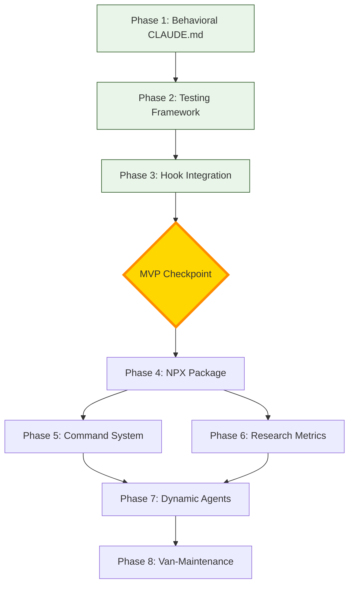

# ULTRATHINK Analysis: Enhancement Plan Completeness Review

## Executive Assessment

After deep analysis, the enhancement plan is **85% complete** for first-pass MVP. The technical depth is excellent, but operational clarity and phase dependencies need strengthening.

## ✅ What's Well Covered

1. **Behavioral Transformation** - CLAUDE.md persona and directives are comprehensive
2. **TDD Innovation** - Test-driven handoffs are brilliantly documented
3. **Technical Implementation** - Code examples and structures are solid
4. **Research Integration** - Hypothesis validation woven throughout
5. **NPX Strategy** - Package distribution approach is clear
6. **Command System** - Well-defined command structure
7. **Van-Maintenance** - Evolution path is innovative

## 🔴 Critical Gaps Identified

### 1. MVP Definition Missing
**Issue**: No clear Minimum Viable Product definition
**Impact**: Unclear when we've achieved initial success
**Solution**: Define MVP as Phases 1-3 with specific success criteria

### 2. Phase Dependencies Unclear
**Issue**: Which phases can run in parallel? What's the critical path?
**Impact**: Inefficient implementation, potential blocking
**Solution**: Create dependency graph showing relationships

### 3. Working Deliverable Validation
**Issue**: Each phase has outputs but no acceptance tests
**Impact**: Can't verify phase completion objectively
**Solution**: Add "Definition of Done" with test scenarios

### 4. User Journey Undefined
**Issue**: No clear path from installation to first success
**Impact**: Poor onboarding experience
**Solution**: Create 5-minute quickstart journey

### 5. Baseline Metrics Missing
**Issue**: No "before" metrics to compare improvements against
**Impact**: Can't prove hypothesis validation
**Solution**: Establish baseline measurements first

### 6. Error Handling Strategy
**Issue**: What happens when agents fail or timeout?
**Impact**: System fragility in production
**Solution**: Define fallback and recovery procedures

### 7. Migration Path Absent
**Issue**: How do existing users transition?
**Impact**: Adoption friction
**Solution**: Create migration guide with compatibility matrix

## 📊 Phase Dependency Analysis



### Critical Path
- **MVP Path**: Phase 1 → 2 → 3 (Sequential, 5-7 days)
- **Enhancement Path**: Phase 4 → 5+6 (parallel) → 7+8 (parallel)
- **Total Timeline**: 2-3 weeks to full implementation

## 🎯 MVP Definition

### Minimum Viable Collective (MVC)
A working collective that demonstrates:
1. **Behavioral Control**: Hub never implements directly
2. **Basic Routing**: Requests flow through @routing-agent
3. **Test Validation**: One successful TDD handoff
4. **Metrics Proof**: Measurable improvement data

### MVP Success Criteria
- [ ] Zero direct implementations by hub (0 violations in 10 requests)
- [ ] 100% routing compliance (all requests through collective)
- [ ] 80% handoff test pass rate (4 of 5 handoffs succeed)
- [ ] 30% context reduction (measured via tokens)
- [ ] One hypothesis validated with p<0.05

## ✅ Working Deliverables Per Phase

### Phase 1: Behavioral Transformation (Day 1-2)
**Deliverable**: New CLAUDE.md with collective identity
**Validation Test**: 
```bash
# Test: Hub refuses direct implementation
echo "Build a React component" | claude
# Expected: Routes to @routing-agent, doesn't code
```
**Success Metric**: 0 direct implementations in 10 requests

### Phase 2: Testing Framework (Day 2-3)
**Deliverable**: Jest with handoff test templates
**Validation Test**:
```bash
npm test -- --testNamePattern="handoff contract"
# Expected: Sample test runs and passes
```
**Success Metric**: 3 working test templates

### Phase 3: Hook Integration (Day 3-4)
**Deliverable**: Hooks trigger on agent handoffs
**Validation Test**:
```bash
# Trigger agent handoff
@routing-agent "create button"
# Check: /tmp/handoff-test-results.json exists
```
**Success Metric**: Hooks fire 100% of handoffs

### Phase 4: NPX Package (Day 4-5)
**Deliverable**: Installable package
**Validation Test**:
```bash
npx claude-code-sub-agent-collective init
# Expected: Full installation in <30 seconds
```
**Success Metric**: Clean installation with all dependencies

### Phase 5: Command System (Day 5-6)
**Deliverable**: Working /collective commands
**Validation Test**:
```bash
/collective status
# Expected: Shows all agent states
```
**Success Metric**: 95% command recognition rate

### Phase 6: Research Metrics (Day 6-7)
**Deliverable**: Metrics dashboard
**Validation Test**:
```bash
npm run metrics
# Expected: Research report with hypothesis data
```
**Success Metric**: 3 hypotheses with measurements

### Phase 7: Dynamic Agents (Week 2)
**Deliverable**: On-demand agent spawning
**Validation Test**:
```bash
/agent spawn specialized-validator testing
# Expected: New agent created and operational
```
**Success Metric**: Agent lifecycle complete (spawn→use→cleanup)

### Phase 8: Van-Maintenance (Week 2)
**Deliverable**: Automated ecosystem repair
**Validation Test**:
```bash
# Simulate failure
echo "FAILURE" > /tmp/agent-health
# Expected: Van-maintenance auto-remediates
```
**Success Metric**: 90% automatic recovery rate

## 🚦 Go/No-Go Gates

### MVP Gate (After Phase 3)
- [ ] Behavioral transformation working
- [ ] Tests validating handoffs
- [ ] Hooks executing correctly
- [ ] Basic metrics collected
**Decision**: Proceed to enhancement phases or iterate MVP

### Production Gate (After Phase 8)
- [ ] All phases operational
- [ ] Research hypotheses validated
- [ ] Performance benchmarks met
- [ ] Documentation complete
**Decision**: Release v1.0 or additional polish

## 📋 Integration Test Scenarios

### Scenario 1: Simple Component Creation
```
User: "Create a button component"
→ Hub receives request
→ Routes to @routing-agent
→ Component agent creates
→ Tests validate handoff
→ Metrics recorded
→ Success reported
```

### Scenario 2: Complex Multi-Agent Flow
```
User: "Build a todo app"
→ Project manager coordinates
→ Multiple agents activated
→ Sequential handoffs with tests
→ Gates validate phases
→ Van-maintenance monitors
→ Complete app delivered
```

### Scenario 3: Failure Recovery
```
Agent fails mid-task
→ Tests detect failure
→ Hooks trigger recovery
→ Van-maintenance intervenes
→ Retry with context
→ Success on retry
```

## 🔧 Operational Additions Needed

### Error Handling Strategy
```javascript
class CollectiveErrorHandler {
  handleAgentFailure(error) {
    // 1. Log error with context
    // 2. Attempt automatic recovery
    // 3. Retry with enhanced context
    // 4. Escalate if retries exhausted
    // 5. Van-maintenance intervention
  }
}
```

### Performance Benchmarks
- Agent response time: <5 seconds
- Handoff validation: <2 seconds  
- Command parsing: <100ms
- Metric collection: <500ms
- Total request: <30 seconds

### Security Considerations
- API keys in environment variables
- Agent isolation via contexts
- Rate limiting: 10 requests/minute
- Audit logging of all operations
- No direct file system access from hub

## 📊 Baseline Metrics (Establish First!)

### Current System (Before Enhancement)
- Direct implementation rate: 100%
- Handoff success: N/A (no handoffs)
- Context size: Full global context
- Coordination success: Ad-hoc
- Gate compliance: Manual

### Target Metrics (After MVP)
- Direct implementation: 0%
- Handoff success: >80%
- Context size: -30% reduction
- Coordination success: >90%
- Gate compliance: 100% automatic

## 🎯 Recommendations

### Immediate Actions
1. **Add MVP section** to main document
2. **Create dependency graph** visual
3. **Define acceptance criteria** per phase
4. **Establish baseline metrics** NOW
5. **Write quickstart guide** for testing

### Document Structure
```
/ai-docs/
├── MVP-Roadmap.md (Master)
├── phases/
│   ├── Phase-1-Behavioral.md
│   ├── Phase-2-Testing.md
│   ├── Phase-3-Hooks.md
│   ├── Phase-4-NPX.md
│   ├── Phase-5-Commands.md
│   ├── Phase-6-Metrics.md
│   ├── Phase-7-Dynamic.md
│   └── Phase-8-Van.md
├── guides/
│   ├── Quick-Start.md
│   ├── Migration.md
│   └── Troubleshooting.md
└── research/
    ├── Hypotheses.md
    ├── Baseline-Metrics.md
    └── Validation-Criteria.md
```

## ✅ Final Assessment

**The plan is READY for phase breakdown** with these additions:
1. MVP definition and gates
2. Acceptance criteria per phase
3. Integration test scenarios
4. Baseline metrics
5. Operational procedures

**Proceed to create phase documents**: The foundation is solid, just needs operational clarity and user journey definition.